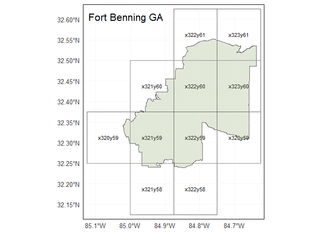

mirta
================
SL
July 1, 2019

Load MIRTA Data
---------------

Accessed from: <https://catalog.data.gov/dataset/military-installations-ranges-and-training-areas> Metadata updated date: January 18, 2017

``` r
#Ref: http://strimas.com/r/tidy-sf/
bases <- st_read("installations_ranges/MIRTA_Boundaries.shp") %>% 
  janitor::clean_names()
```

    ## Reading layer `MIRTA_Boundaries' from data source `C:\Users\slewa\OneDrive - cumc.columbia.edu\Documents\heat\installations_ranges\MIRTA_Boundaries.shp' using driver `ESRI Shapefile'
    ## Simple feature collection with 750 features and 6 fields
    ## geometry type:  MULTIPOLYGON
    ## dimension:      XY
    ## bbox:           xmin: -168.8576 ymin: 13.30706 xmax: 174.1565 ymax: 64.87792
    ## epsg (SRID):    4326
    ## proj4string:    +proj=longlat +datum=WGS84 +no_defs

``` r
# convert to SpatialPolygonsDataFrame
# bases_sp <- as(bases, "Spatial")

class(bases)
```

    ## [1] "sf"         "data.frame"

``` r
glimpse(bases)
```

    ## Observations: 750
    ## Variables: 7
    ## $ component  <fct> Army Guard, Army Guard, Army Guard, Army Guard, Arm...
    ## $ site_name  <fct> "Orchard Range TS Boise", "Fort Pickett, ARNG MTC",...
    ## $ joint_base <fct> N/A, N/A, N/A, N/A, N/A, N/A, N/A, N/A, N/A, N/A, N...
    ## $ state_terr <fct> Idaho, Virginia, Iowa, Missouri, Michigan, Tennesse...
    ## $ country    <fct> United States, United States, United States, United...
    ## $ oper_stat  <fct> Active, Active, Active, Active, Active, Active, Act...
    ## $ geometry   <MULTIPOLYGON [°]> MULTIPOLYGON (((-116.1344 4..., MULTIP...

``` r
st_crs(bases)
```

    ## Coordinate Reference System:
    ##   EPSG: 4326 
    ##   proj4string: "+proj=longlat +datum=WGS84 +no_defs"

``` r
as_tibble(bases)
```

    ## # A tibble: 750 x 7
    ##    component site_name joint_base state_terr country oper_stat
    ##    <fct>     <fct>     <fct>      <fct>      <fct>   <fct>    
    ##  1 Army Gua~ Orchard ~ N/A        Idaho      United~ Active   
    ##  2 Army Gua~ Fort Pic~ N/A        Virginia   United~ Active   
    ##  3 Army Gua~ Camp Dod~ N/A        Iowa       United~ Active   
    ##  4 Army Gua~ NG TS Cl~ N/A        Missouri   United~ Active   
    ##  5 Army Gua~ CTC Fort~ N/A        Michigan   United~ Active   
    ##  6 Army Gua~ NG Jacks~ N/A        Tennessee  United~ Active   
    ##  7 Army Gua~ NG Nashv~ N/A        Tennessee  United~ Active   
    ##  8 Army Gua~ NG VTS S~ N/A        Tennessee  United~ Active   
    ##  9 Army Gua~ NG Young~ N/A        New York   United~ Active   
    ## 10 Army Gua~ NG Aubur~ N/A        Maine      United~ Active   
    ## # ... with 740 more rows, and 1 more variable: geometry <MULTIPOLYGON [°]>

Select Active Army Installations
--------------------------------

Note: FSH, TX listed under Air Force; Fort Benning split between GA and AL

``` r
bases %>% 
  filter(component == "Army Active") %>% 
  .$site_name
```

    ##   [1] Fort Monroe                                 
    ##   [2] Radford AAP                                 
    ##   [3] Walter Reed AMC Main Post                   
    ##   [4] Kansas AAP                                  
    ##   [5] Newport Chem Depot                          
    ##   [6] Defense Distrib Depot Susq                  
    ##   [7] Detroit Arsenal                             
    ##   [8] Fort Benning GA                             
    ##   [9] Fort Benning                                
    ##  [10] Military Ocean Tml Sunny Point              
    ##  [11] Tobyhanna Army Depot                        
    ##  [12] Stewart Annex                               
    ##  [13] Defense Distribution Region West Sharpe Site
    ##  [14] Defense Distribution Region West Tracy      
    ##  [15] Defense General Supply Center               
    ##  [16] Pupukea Paalaa Uka Mil Road                 
    ##  [17] Cornhusker AAP                              
    ##  [18] Green River Test Complex                    
    ##  [19] Badger AAP                                  
    ##  [20] Fort Campbell                               
    ##  [21] Fort Knox                                   
    ##  [22] Fort Lee                                    
    ##  [23] Fort Monmouth Main Post                     
    ##  [24] Iowa AAP                                    
    ##  [25] Letterkenny Army Depot                      
    ##  [26] Riverbank AAP                               
    ##  [27] Pueblo Chemical Depot                       
    ##  [28] Rock Island Arsenal                         
    ##  [29] Waianae-Kai Military Reservation            
    ##  [30] Scranton AAP                                
    ##  [31] Watervliet Arsenal                          
    ##  [32] US Army Joint Sys Mfg Ctr Lima              
    ##  [33] Fort Bliss AAA Ranges                       
    ##  [34] Kilauea Military Reserve                    
    ##  [35] Fort Benjamin Harrison                      
    ##  [36] McAlester AAP                               
    ##  [37] Fort Huachuca                               
    ##  [38] Fort Leavenworth                            
    ##  [39] Goldberg Stagefield                         
    ##  [40] Hunt Stagefield                             
    ##  [41] Fort Rucker                                 
    ##  [42] Holston AAP                                 
    ##  [43] Lake City AAP                               
    ##  [44] Deseret Chemical Depot                      
    ##  [45] Fort Riley                                  
    ##  [46] Hawthorne Army Depot                        
    ##  [47] Kipapa Ammo Storage Site                    
    ##  [48] Makua Military Reserve                      
    ##  [49] Helemano Military Reservation               
    ##  [50] Military Ocean Terminal Concord             
    ##  [51] Cairns Basefield                            
    ##  [52] Allen Stagefield                            
    ##  [53] Anniston Army Depot                         
    ##  [54] Blossom Point Research Facility             
    ##  [55] Brown Stagefield                            
    ##  [56] Yuma Proving Ground                         
    ##  [57] USA Field Station Kunia                     
    ##  [58] Toth Stagefield                             
    ##  [59] Stinson Stagefield                          
    ##  [60] Skelly Stagefield                           
    ##  [61] Sierra Army Depot                           
    ##  [62] Shell Basefield                             
    ##  [63] Schofield Bks Military Reservation          
    ##  [64] Redstone Arsenal                            
    ##  [65] Pohakuloa Training Area                     
    ##  [66] Pine Bluff Arsenal                          
    ##  [67] NTC and Fort Irwin                          
    ##  [68] Defense Supply Center Columbus              
    ##  [69] Blue Grass Army Depot                       
    ##  [70] Fort Gordon                                 
    ##  [71] Kahuku Training Area                        
    ##  [72] Wheeler Army Airfield                       
    ##  [73] Fort Gillem                                 
    ##  [74] Presidio Of Monterey                        
    ##  [75] Yakima Training Center                      
    ##  [76] Umatilla Chem Depot                         
    ##  [77] Dugway Proving Ground                       
    ##  [78] Highbluff Stagefield                        
    ##  [79] Fort Sill                                   
    ##  [80] Fort Carson                                 
    ##  [81] Fort Lewis                                  
    ##  [82] Aberdeen Proving Ground                     
    ##  [83] Fort Greely                                 
    ##  [84] Picatinny Arsenal                           
    ##  [85] Fort A P Hill                               
    ##  [86] Camp Mackall                                
    ##  [87] Fort Bragg                                  
    ##  [88] Fort McPherson                              
    ##  [89] Fort Detrick                                
    ##  [90] Fort Belvoir                                
    ##  [91] USA Adelphi Laboratory Ctr                  
    ##  [92] West Point Mil Reservation                  
    ##  [93] Fort Hamilton                               
    ##  [94] Tooele Army Depot                           
    ##  [95] Fort Lesley J McNair                        
    ##  [96] Longhorn AAP                                
    ##  [97] Red River Army Depot                        
    ##  [98] Fort Myer                                   
    ##  [99] Arlington National Cemetery                 
    ## [100] White Sands Missile Range                   
    ## [101] Fort Polk                                   
    ## [102] Fort Jackson                                
    ## [103] Fort Detrick Forest Glen Annex              
    ## [104] Fort Leonard Wood                           
    ## [105] Milan AAP                                   
    ## [106] Fort De Russy                               
    ## [107] Fort Shafter                                
    ## [108] Kawaihae Military Reserve                   
    ## [109] Tripler AMC                                 
    ## [110] Aliamanu Military Reservation               
    ## [111] Carlisle Barracks                           
    ## [112] Fort Bliss                                  
    ## [113] Fort George G Meade                         
    ## [114] Fort Hood                                   
    ## [115] US Army Soldier Systems Center Natick       
    ## [116] Fort Drum                                   
    ## [117] Fort Wainwright                             
    ## [118] Fort Stewart                                
    ## 750 Levels: 4th MARDIV Brooklyn ... Yuma Proving Ground

Feature information
-------------------

``` r
bases_geom <- st_geometry(bases)
st_geometry(bases) %>% class()
```

    ## [1] "sfc_MULTIPOLYGON" "sfc"

``` r
attributes(bases_geom)
```

    ## $n_empty
    ## [1] 0
    ## 
    ## $crs
    ## Coordinate Reference System:
    ##   EPSG: 4326 
    ##   proj4string: "+proj=longlat +datum=WGS84 +no_defs"
    ## 
    ## $class
    ## [1] "sfc_MULTIPOLYGON" "sfc"             
    ## 
    ## $precision
    ## [1] 0
    ## 
    ## $bbox
    ##       xmin       ymin       xmax       ymax 
    ## -168.85755   13.30706  174.15652   64.87792

``` r
bases_geom[[1]] %>% class
```

    ## [1] "XY"           "MULTIPOLYGON" "sfg"

Inspection plot - world
-----------------------

``` r
world <- ne_countries(scale = "medium", returnclass = "sf")

ggplot() +
  geom_sf(data = world, fill = NA) +
  geom_sf(data = bases, color = "darkgreen", fill = "lightgreen") +
  ggtitle("DoD Installations") +
  theme_bw()
```


Select specific installations
-----------------------------

``` r
army_select <-
bases %>% 
  filter(.$site_name %in% c("Fort Bragg", "Fort Benning GA", "Fort Benning", "Fort Campbell" ))

ggplot(army_select) +
  ggtitle("Bragg. Benning, Campbell") +
  geom_sf() +
  theme_bw()
```


``` r
bragg <-
bases %>% 
  filter(.$site_name == "Fort Bragg")

# Save shapefile
# st_write(bragg, "bragg.shp")

st_centroid(bragg) %>% 
  as.tibble()
```

    ## Warning in st_centroid.sf(bragg): st_centroid assumes attributes are
    ## constant over geometries of x

    ## Warning in st_centroid.sfc(st_geometry(x), of_largest_polygon =
    ## of_largest_polygon): st_centroid does not give correct centroids for
    ## longitude/latitude data

    ## Warning: `as.tibble()` is deprecated, use `as_tibble()` (but mind the new semantics).
    ## This warning is displayed once per session.

    ## # A tibble: 1 x 7
    ##   component site_name joint_base state_terr country oper_stat
    ##   <fct>     <fct>     <fct>      <fct>      <fct>   <fct>    
    ## 1 Army Act~ Fort Bra~ N/A        North Car~ United~ Active   
    ## # ... with 1 more variable: geometry <POINT [°]>

``` r
bragg_centroid <- st_centroid(bragg)
```

    ## Warning in st_centroid.sf(bragg): st_centroid assumes attributes are
    ## constant over geometries of x

    ## Warning in st_centroid.sfc(st_geometry(x), of_largest_polygon =
    ## of_largest_polygon): st_centroid does not give correct centroids for
    ## longitude/latitude data

``` r
ggplot(bragg) +
  ggtitle("Fort Bragg") +
  geom_sf() +
  theme_bw()
```


``` r
ggplot(bases %>% 
  filter(.$site_name %in% c("Fort Benning GA", "Fort Benning"))) +
  ggtitle("Fort Benning") +
  geom_sf() +
  theme_bw()
```


Load NLDAS grids
----------------

NLDAS grid shapefile from: <https://ldas.gsfc.nasa.gov/sites/default/files/ldas/nldas/NLDAS_Grid_Reference.zip>

``` r
nldas_grid <- st_read("nldas_grids/NLDAS_Grid_Reference.shp") %>% 
  janitor::clean_names()
```

    ## Reading layer `NLDAS_Grid_Reference' from data source `C:\Users\slewa\OneDrive - cumc.columbia.edu\Documents\heat\nldas_grids\NLDAS_Grid_Reference.shp' using driver `ESRI Shapefile'
    ## Simple feature collection with 103936 features and 5 fields
    ## geometry type:  POLYGON
    ## dimension:      XY
    ## bbox:           xmin: -125 ymin: 25 xmax: -67 ymax: 53
    ## epsg (SRID):    4326
    ## proj4string:    +proj=longlat +datum=WGS84 +no_defs

``` r
class(nldas_grid)
```

    ## [1] "sf"         "data.frame"

``` r
glimpse(nldas_grid)
```

    ## Observations: 103,936
    ## Variables: 6
    ## $ centerx  <dbl> -124.9375, -124.8125, -124.6875, -124.5625, -124.4375...
    ## $ centery  <dbl> 25.0625, 25.0625, 25.0625, 25.0625, 25.0625, 25.0625,...
    ## $ nldas_x  <int> 1, 2, 3, 4, 5, 6, 7, 8, 9, 10, 11, 12, 13, 14, 15, 16...
    ## $ nldas_y  <int> 1, 1, 1, 1, 1, 1, 1, 1, 1, 1, 1, 1, 1, 1, 1, 1, 1, 1,...
    ## $ nldas_id <fct> x1y1, x2y1, x3y1, x4y1, x5y1, x6y1, x7y1, x8y1, x9y1,...
    ## $ geometry <POLYGON [°]> POLYGON ((-124.875 25, -125..., POLYGON ((-12...

``` r
st_crs(nldas_grid)
```

    ## Coordinate Reference System:
    ##   EPSG: 4326 
    ##   proj4string: "+proj=longlat +datum=WGS84 +no_defs"

``` r
as_tibble(nldas_grid)
```

    ## # A tibble: 103,936 x 6
    ##    centerx centery nldas_x nldas_y nldas_id                        geometry
    ##      <dbl>   <dbl>   <int>   <int> <fct>                      <POLYGON [°]>
    ##  1   -125.    25.1       1       1 x1y1     ((-124.875 25, -125 25, -125 2~
    ##  2   -125.    25.1       2       1 x2y1     ((-124.75 25, -124.875 25, -12~
    ##  3   -125.    25.1       3       1 x3y1     ((-124.625 25, -124.75 25, -12~
    ##  4   -125.    25.1       4       1 x4y1     ((-124.5 25, -124.625 25, -124~
    ##  5   -124.    25.1       5       1 x5y1     ((-124.375 25, -124.5 25, -124~
    ##  6   -124.    25.1       6       1 x6y1     ((-124.25 25, -124.375 25, -12~
    ##  7   -124.    25.1       7       1 x7y1     ((-124.125 25, -124.25 25, -12~
    ##  8   -124.    25.1       8       1 x8y1     ((-124 25, -124.125 25, -124.1~
    ##  9   -124.    25.1       9       1 x9y1     ((-123.875 25, -124 25, -124 2~
    ## 10   -124.    25.1      10       1 x10y1    ((-123.75 25, -123.875 25, -12~
    ## # ... with 103,926 more rows

NLDAS and Installation Grid Overlap and Weighted Averages
---------------------------------------------------------

``` r
bragg_nldas <-
  st_intersection(bragg, nldas_grid) %>% 
  mutate(area = sf::st_area(.),
         weight = area / sum(area))
```

    ## although coordinates are longitude/latitude, st_intersection assumes that they are planar

    ## Warning: attribute variables are assumed to be spatially constant
    ## throughout all geometries

``` r
bragg_intersects <-
  nldas_grid %>% filter(lengths(st_intersects(., bragg)) > 0)
```

    ## although coordinates are longitude/latitude, st_intersects assumes that they are planar

``` r
as.data.frame(bragg_intersects) %>% 
  select(-geometry)
```

    ##     centerx centery nldas_x nldas_y nldas_id
    ## 1  -79.4375 35.0625     365      81  x365y81
    ## 2  -79.3125 35.0625     366      81  x366y81
    ## 3  -79.1875 35.0625     367      81  x367y81
    ## 4  -79.0625 35.0625     368      81  x368y81
    ## 5  -78.9375 35.0625     369      81  x369y81
    ## 6  -79.3125 35.1875     366      82  x366y82
    ## 7  -79.1875 35.1875     367      82  x367y82
    ## 8  -79.0625 35.1875     368      82  x368y82
    ## 9  -78.9375 35.1875     369      82  x369y82
    ## 10 -79.0625 35.3125     368      83  x368y83
    ## 11 -78.9375 35.3125     369      83  x369y83

``` r
bragg_nldas
```

    ## Simple feature collection with 11 features and 13 fields
    ## geometry type:  GEOMETRY
    ## dimension:      XY
    ## bbox:           xmin: -79.38063 ymin: 35.03946 xmax: -78.90188 ymax: 35.27456
    ## epsg (SRID):    4326
    ## proj4string:    +proj=longlat +datum=WGS84 +no_defs
    ## First 10 features:
    ##      component  site_name joint_base     state_terr       country
    ## 1  Army Active Fort Bragg        N/A North Carolina United States
    ## 2  Army Active Fort Bragg        N/A North Carolina United States
    ## 3  Army Active Fort Bragg        N/A North Carolina United States
    ## 4  Army Active Fort Bragg        N/A North Carolina United States
    ## 5  Army Active Fort Bragg        N/A North Carolina United States
    ## 6  Army Active Fort Bragg        N/A North Carolina United States
    ## 7  Army Active Fort Bragg        N/A North Carolina United States
    ## 8  Army Active Fort Bragg        N/A North Carolina United States
    ## 9  Army Active Fort Bragg        N/A North Carolina United States
    ## 10 Army Active Fort Bragg        N/A North Carolina United States
    ##    oper_stat  centerx centery nldas_x nldas_y nldas_id
    ## 1     Active -79.4375 35.0625     365      81  x365y81
    ## 2     Active -79.3125 35.0625     366      81  x366y81
    ## 3     Active -79.1875 35.0625     367      81  x367y81
    ## 4     Active -79.0625 35.0625     368      81  x368y81
    ## 5     Active -78.9375 35.0625     369      81  x369y81
    ## 6     Active -79.3125 35.1875     366      82  x366y82
    ## 7     Active -79.1875 35.1875     367      82  x367y82
    ## 8     Active -79.0625 35.1875     368      82  x368y82
    ## 9     Active -78.9375 35.1875     369      82  x369y82
    ## 10    Active -79.0625 35.3125     368      83  x368y83
    ##                          geometry              area           weight
    ## 1  POLYGON ((-79.375 35.11408,...    267870.6 [m^2] 0.0004273396 [1]
    ## 2  POLYGON ((-79.25 35.0421, -...  85682501.6 [m^2] 0.1366911038 [1]
    ## 3  POLYGON ((-79.125 35.04959,... 103830342.2 [m^2] 0.1656427369 [1]
    ## 4  POLYGON ((-79 35.10627, -79...  71718332.8 [m^2] 0.1144137705 [1]
    ## 5  MULTIPOLYGON (((-78.92337 3...   8288123.1 [m^2] 0.0132222178 [1]
    ## 6  POLYGON ((-79.37345 35.125,...  58628497.8 [m^2] 0.0935312803 [1]
    ## 7  POLYGON ((-79.25 35.20718, ...  85822173.7 [m^2] 0.1369139255 [1]
    ## 8  MULTIPOLYGON (((-79.00621 3... 141136566.4 [m^2] 0.2251581440 [1]
    ## 9  MULTIPOLYGON (((-78.96197 3...  61218699.6 [m^2] 0.0976634839 [1]
    ## 10 MULTIPOLYGON (((-79.07842 3...   5968542.1 [m^2] 0.0095217413 [1]

``` r
sum(bragg_nldas$area)
```

    ## 626833051 [m^2]

``` r
sum(bragg_nldas$weight)
```

    ## 1 [1]

``` r
st_area(bragg_nldas) 
```

    ## Units: [m^2]
    ##  [1]    267870.6  85682501.6 103830342.2  71718332.8   8288123.1
    ##  [6]  58628497.8  85822173.7 141136566.4  61218699.6   5968542.1
    ## [11]   4271401.2

``` r
ggplot(bragg_nldas) + 
  ggtitle("Fort Bragg NLDAS grids") +
  geom_sf() +
  geom_label(data = bragg_nldas, aes(x = centerx, y = centery, label = nldas_id), size = 3, fontface = "bold") +
  geom_text(data = bragg_nldas, aes(x = centerx, y = centery, label =  formatC(weight, format = "f", digits = 3)) , size = 3, position = position_nudge(y = -0.02)) +
  theme_bw()
```


Bounding box for installation
-----------------------------

``` r
st_bbox(bragg) %>% 
  .[c("ymin", "xmin", "ymax", "xmax")]
```

    ##      ymin      xmin      ymax      xmax 
    ##  35.03946 -79.38063  35.27456 -78.90188

``` r
bb_bragg <- st_as_sfc(st_bbox(bragg))
class(bb_bragg)
```

    ## [1] "sfc_POLYGON" "sfc"

Plots of intersecting NLDAS grids

``` r
ggplot() +
  geom_sf(data = bragg_nldas) +
  geom_sf(data = bb_bragg , color = "blue", fill = "NA") +
  geom_sf(data = bragg_centroid, color = "red") +
  ggtitle("Fort Bragg Bounding Box") +
  geom_label(data = bragg_nldas, aes(x = centerx, y = centery, label = nldas_id), size = 3, fontface = "bold") +
  geom_text(data = bragg_nldas, aes(x = centerx, y = centery, label =  formatC(weight, format = "f", digits = 3)) , size = 3, position = position_nudge(y = -0.02)) +
  theme_bw()
```


``` r
ggplot() +
  geom_sf(data = bragg_intersects) +
  geom_sf(data = bb_bragg , color = "blue", fill = "NA") +
  geom_sf(data = bragg_centroid, color = "red") +
  geom_sf(data = bragg, fill = "NA") +
  ggtitle("Fort Bragg Intersecting Grids") +
  geom_label(data = bragg_nldas, aes(x = centerx, y = centery, label = nldas_id), size = 3, fontface = "bold") +
  geom_text(data = bragg_nldas, aes(x = centerx, y = centery, label =  formatC(weight, format = "f", digits = 3)) , size = 3, position = position_nudge(y = -0.03)) +
  theme_bw()
```


