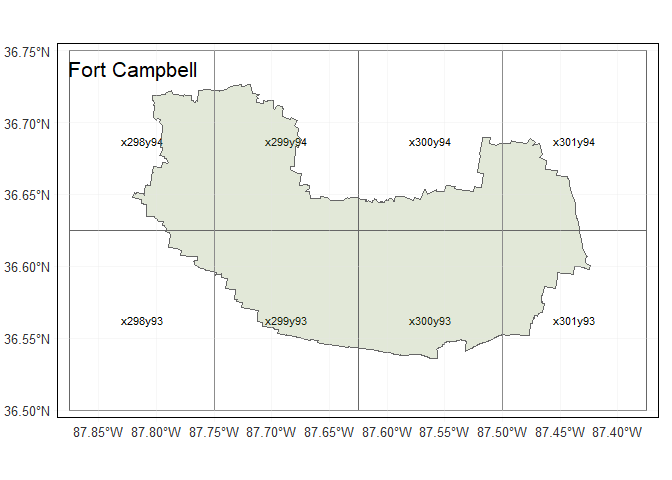
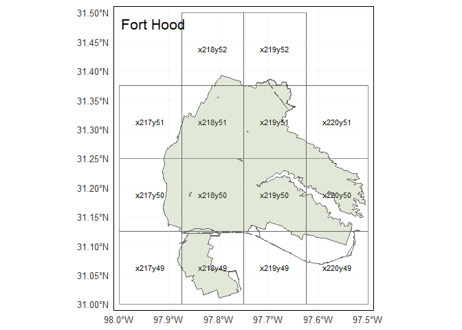

Shapefile and Grid Geometries
================
SL
July 1, 2019

Load Military Installations, Ranges, and Training Areas (MIRTA) Dataset
-----------------------------------------------------------------------

Accessed from: <https://catalog.data.gov/dataset/military-installations-ranges-and-training-areas> Metadata updated date: January 18, 2017

``` r
#Ref: http://strimas.com/r/tidy-sf/
bases <- st_read("installations_ranges/MIRTA_Boundaries.shp") %>% 
  janitor::clean_names()
```

    ## Reading layer `MIRTA_Boundaries' from data source `C:\Users\slewa\OneDrive - cumc.columbia.edu\Documents\heat\installations_ranges\MIRTA_Boundaries.shp' using driver `ESRI Shapefile'
    ## Simple feature collection with 750 features and 6 fields
    ## geometry type:  MULTIPOLYGON
    ## dimension:      XY
    ## bbox:           xmin: -168.8576 ymin: 13.30706 xmax: 174.1565 ymax: 64.87792
    ## epsg (SRID):    4326
    ## proj4string:    +proj=longlat +datum=WGS84 +no_defs

``` r
# convert to SpatialPolygonsDataFrame
# bases_sp <- as(bases, "Spatial")
st_crs(bases)
```

    ## Coordinate Reference System:
    ##   EPSG: 4326 
    ##   proj4string: "+proj=longlat +datum=WGS84 +no_defs"

``` r
as_tibble(bases)
```

    ## # A tibble: 750 x 7
    ##    component site_name joint_base state_terr country oper_stat
    ##    <fct>     <fct>     <fct>      <fct>      <fct>   <fct>    
    ##  1 Army Gua~ Orchard ~ N/A        Idaho      United~ Active   
    ##  2 Army Gua~ Fort Pic~ N/A        Virginia   United~ Active   
    ##  3 Army Gua~ Camp Dod~ N/A        Iowa       United~ Active   
    ##  4 Army Gua~ NG TS Cl~ N/A        Missouri   United~ Active   
    ##  5 Army Gua~ CTC Fort~ N/A        Michigan   United~ Active   
    ##  6 Army Gua~ NG Jacks~ N/A        Tennessee  United~ Active   
    ##  7 Army Gua~ NG Nashv~ N/A        Tennessee  United~ Active   
    ##  8 Army Gua~ NG VTS S~ N/A        Tennessee  United~ Active   
    ##  9 Army Gua~ NG Young~ N/A        New York   United~ Active   
    ## 10 Army Gua~ NG Aubur~ N/A        Maine      United~ Active   
    ## # ... with 740 more rows, and 1 more variable: geometry <MULTIPOLYGON [°]>

``` r
## Feature information
bases_geom <- st_geometry(bases)
st_geometry(bases) %>% class()
attributes(bases_geom)
bases_geom[[1]] %>% class
```

Inspection plot - world
-----------------------

``` r
world <- ne_countries(scale = "medium", returnclass = "sf")

ggplot() +
  geom_sf(data = world, fill = NA) +
  geom_sf(data = bases, color = "darkgreen", fill = "lightgreen") +
  coord_sf(xlim = c(-125, -67), ylim = c(25,53)) +
  ggtitle("DoD Installations in NLDAS Coverage") +
  theme_bw()
```


Modify specific installations
-----------------------------

``` r
## Join Fort Benning Georgia and Alabama shapefiles (st_union)
benning_geom <-
  bases %>%
    filter(stringr::str_detect(site_name, "Fort Benning")) %>% 
    dplyr::select(geometry) %>% st_union() 
```

Select installations
--------------------

``` r
## Create dataframe of active duty Army installations, including FSH (JBSA) and single Fort Benning row 

army_bases <-
  bases %>%
    filter(oper_stat == "Active") %>% 
    mutate(component = replace(component, site_name == "Fort Sam Houston", "Army Active")) %>%
    filter(component == "Army Active") %>%
    filter(site_name != "Fort Benning") %>%
    mutate(geometry = replace(geometry, site_name == "Fort Benning GA", benning_geom ))
   

## Filter installations of interest

army_select <-
  army_bases %>% 
    dplyr::filter(.$site_name %in% c("Fort Benning GA", "Fort Bragg","Fort Campbell",
                              "Fort Jackson", "Fort Polk", "Fort Hood",
                              "Fort Stewart", "Fort Leonard Wood", "Fort Riley",
                              "NTC and Fort Irwin")) %>% 
    mutate(centroid = st_centroid(geometry)) %>% 
    dplyr::select(-c("component", "joint_base", "country", "oper_stat"))


st_crs(army_select)
```

    ## Coordinate Reference System:
    ##   EPSG: 4326 
    ##   proj4string: "+proj=longlat +datum=WGS84 +no_defs"

``` r
as_tibble(army_select)
```

    ## # A tibble: 10 x 4
    ##    site_name state_terr                  geometry                  centroid
    ##    <fct>     <fct>                 <GEOMETRY [°]>               <POINT [°]>
    ##  1 Fort Ben~ Georgia    POLYGON ((-84.8882 32.25~       (-84.81164 32.3917)
    ##  2 Fort Cam~ Kentucky   MULTIPOLYGON (((-87.6513~       (-87.62461 36.6222)
    ##  3 Fort Ril~ Kansas     MULTIPOLYGON (((-96.9351~      (-96.82482 39.20675)
    ##  4 NTC and ~ California MULTIPOLYGON (((-116.389~      (-116.6333 35.37432)
    ##  5 Fort Bra~ North Car~ MULTIPOLYGON (((-78.9619~      (-79.14397 35.13624)
    ##  6 Fort Polk Louisiana  MULTIPOLYGON (((-93.1156~      (-93.12082 31.15788)
    ##  7 Fort Jac~ South Car~ MULTIPOLYGON (((-80.8091~      (-80.82734 34.03994)
    ##  8 Fort Leo~ Missouri   MULTIPOLYGON (((-92.0595~         (-92.1493 37.712)
    ##  9 Fort Hood Texas      MULTIPOLYGON (((-97.7550~      (-97.74244 31.21746)
    ## 10 Fort Ste~ Georgia    MULTIPOLYGON (((-81.7336~      (-81.61637 31.99366)

Plot selected shapefiles
------------------------

``` r
## Plot selected installations
bases_plot <- purrr::map(army_select$site_name,
           function(x) {
             ggplot() +
               geom_sf(data = filter(army_select, site_name == x)) +
                ggtitle(x) +
                theme_bw() +
                theme(axis.text.x = element_text(size = rel(0.6)),
                      axis.text.y = element_text(size = rel(0.6))) 
           })

cowplot::plot_grid(plotlist = bases_plot)
```


Load NLDAS grids
----------------

NLDAS grid shapefile from: <https://ldas.gsfc.nasa.gov/sites/default/files/ldas/nldas/NLDAS_Grid_Reference.zip>

``` r
nldas_grid <- st_read("nldas_grids/NLDAS_Grid_Reference.shp") %>% 
  janitor::clean_names()
```

    ## Reading layer `NLDAS_Grid_Reference' from data source `C:\Users\slewa\OneDrive - cumc.columbia.edu\Documents\heat\nldas_grids\NLDAS_Grid_Reference.shp' using driver `ESRI Shapefile'
    ## Simple feature collection with 103936 features and 5 fields
    ## geometry type:  POLYGON
    ## dimension:      XY
    ## bbox:           xmin: -125 ymin: 25 xmax: -67 ymax: 53
    ## epsg (SRID):    4326
    ## proj4string:    +proj=longlat +datum=WGS84 +no_defs

``` r
st_crs(nldas_grid)
```

    ## Coordinate Reference System:
    ##   EPSG: 4326 
    ##   proj4string: "+proj=longlat +datum=WGS84 +no_defs"

``` r
as_tibble(nldas_grid)
```

    ## # A tibble: 103,936 x 6
    ##    centerx centery nldas_x nldas_y nldas_id                        geometry
    ##      <dbl>   <dbl>   <int>   <int> <fct>                      <POLYGON [°]>
    ##  1   -125.    25.1       1       1 x1y1     ((-124.875 25, -125 25, -125 2~
    ##  2   -125.    25.1       2       1 x2y1     ((-124.75 25, -124.875 25, -12~
    ##  3   -125.    25.1       3       1 x3y1     ((-124.625 25, -124.75 25, -12~
    ##  4   -125.    25.1       4       1 x4y1     ((-124.5 25, -124.625 25, -124~
    ##  5   -124.    25.1       5       1 x5y1     ((-124.375 25, -124.5 25, -124~
    ##  6   -124.    25.1       6       1 x6y1     ((-124.25 25, -124.375 25, -12~
    ##  7   -124.    25.1       7       1 x7y1     ((-124.125 25, -124.25 25, -12~
    ##  8   -124.    25.1       8       1 x8y1     ((-124 25, -124.125 25, -124.1~
    ##  9   -124.    25.1       9       1 x9y1     ((-123.875 25, -124 25, -124 2~
    ## 10   -124.    25.1      10       1 x10y1    ((-123.75 25, -123.875 25, -12~
    ## # ... with 103,926 more rows

NLDAS and Installation Grid Overlap and Weighted Averages
---------------------------------------------------------

``` r
# Identify all NLDAS grids intersected by installation shapefiles

bases_nldas = NULL
for (i in 1:nrow(army_select)) {
  base = army_select[i,] 
  base_nldas = st_intersection(base, nldas_grid) 
  bases_nldas = rbind(bases_nldas, base_nldas)
}
rm(base, base_nldas)
bases_nldas
```

    ## Simple feature collection with 135 features and 7 fields
    ## Active geometry column: geometry
    ## geometry type:  GEOMETRY
    ## dimension:      XY
    ## bbox:           xmin: -117.0831 ymin: 30.92187 xmax: -78.90188 ymax: 39.30681
    ## epsg (SRID):    4326
    ## proj4string:    +proj=longlat +datum=WGS84 +no_defs
    ## First 10 features:
    ##           site_name state_terr  centerx centery nldas_x nldas_y nldas_id
    ## 1   Fort Benning GA    Georgia -84.9375 32.1875     321      58  x321y58
    ## 1.1 Fort Benning GA    Georgia -84.8125 32.1875     322      58  x322y58
    ## 1.2 Fort Benning GA    Georgia -85.0625 32.3125     320      59  x320y59
    ## 1.3 Fort Benning GA    Georgia -84.9375 32.3125     321      59  x321y59
    ## 1.4 Fort Benning GA    Georgia -84.8125 32.3125     322      59  x322y59
    ## 1.5 Fort Benning GA    Georgia -84.6875 32.3125     323      59  x323y59
    ## 1.6 Fort Benning GA    Georgia -84.9375 32.4375     321      60  x321y60
    ## 1.7 Fort Benning GA    Georgia -84.8125 32.4375     322      60  x322y60
    ## 1.8 Fort Benning GA    Georgia -84.6875 32.4375     323      60  x323y60
    ## 1.9 Fort Benning GA    Georgia -84.8125 32.5625     322      61  x322y61
    ##                      centroid                       geometry
    ## 1   POINT (-84.81164 32.3917) MULTIPOLYGON (((-84.90602 3...
    ## 1.1 POINT (-84.81164 32.3917) POLYGON ((-84.81997 32.25, ...
    ## 1.2 POINT (-84.81164 32.3917) POLYGON ((-85 32.29875, -85...
    ## 1.3 POINT (-84.81164 32.3917) POLYGON ((-84.8882 32.25929...
    ## 1.4 POINT (-84.81164 32.3917) POLYGON ((-84.75 32.33047, ...
    ## 1.5 POINT (-84.81164 32.3917) POLYGON ((-84.65872 32.375,...
    ## 1.6 POINT (-84.81164 32.3917) MULTIPOLYGON (((-84.97334 3...
    ## 1.7 POINT (-84.81164 32.3917) POLYGON ((-84.875 32.45522,...
    ## 1.8 POINT (-84.81164 32.3917) POLYGON ((-84.63749 32.5, -...
    ## 1.9 POINT (-84.81164 32.3917) POLYGON ((-84.84992 32.5, -...

``` r
# Calculate area of installation in each NLDAS grid and weight for spatial weighted average
nldas_weights <- bases_nldas %>% 
    mutate(area = sf::st_area(.$geometry)) %>% 
  group_by(site_name) %>% 
    mutate(sum_area = sum(area),
           weight = (area / sum_area)) 


# NLDAS grids that intersect with bases (to map full grid squares)
intersects = NULL
for (i in 1:nrow(army_select)) {
  base = army_select[i,] 
  base_intersect = nldas_grid %>% filter(lengths(st_intersects(., base)) > 0)
  intersects = rbind(intersects, base_intersect)
}
rm(base, base_intersect)

# Join `site_name` to selected NLDAS grid geometries

intersects <- intersects %>% left_join(select(as_tibble(nldas_weights), c(nldas_id, site_name)), by = "nldas_id")
```

Bounding box for installation
-----------------------------

``` r
st_bbox(bragg) %>% 
  .[c("ymin", "xmin", "ymax", "xmax")]

bb_bragg <- st_as_sfc(st_bbox(bragg))
class(bb_bragg)
```

``` r
bbox = NULL
for (i in 1:nrow(army_select)) {
  base = army_select[i,] 
  base_bbox = st_bbox(base)
  bbox = rbind(bbox, base_bbox)
}
rm(base, base_bbox)


bbox <-
  as_tibble(army_select[,1]) %>% 
    bind_cols(as_tibble(bbox))

bbox %>% 
  select(-geometry) %>% 
  print()
```

    ## # A tibble: 10 x 5
    ##    site_name            xmin  ymin   xmax  ymax
    ##    <fct>               <dbl> <dbl>  <dbl> <dbl>
    ##  1 Fort Benning GA     -85.0  32.2  -84.6  32.6
    ##  2 Fort Campbell       -87.8  36.5  -87.4  36.7
    ##  3 Fort Riley          -97.0  39.0  -96.7  39.3
    ##  4 NTC and Fort Irwin -117.   35.1 -116.   35.6
    ##  5 Fort Bragg          -79.4  35.0  -78.9  35.3
    ##  6 Fort Polk           -93.6  30.9  -92.9  31.5
    ##  7 Fort Jackson        -81.0  34.0  -80.7  34.1
    ##  8 Fort Leonard Wood   -92.3  37.6  -91.9  38.0
    ##  9 Fort Hood           -97.9  31.0  -97.5  31.4
    ## 10 Fort Stewart        -81.9  31.8  -81.3  32.1

``` r
army_select <- bbox %>% 
  select(-geometry) %>%
  right_join(army_select, by = "site_name")
```

Plots of intersecting NLDAS grids
---------------------------------

``` r
ggplot() + 
  geom_sf(data = bragg_nldas) +
  geom_sf(data = bb_bragg , color = "blue", fill = "NA") +
  geom_sf(data = bragg_centroid, color = "red") +
  ggtitle("Fort Bragg Bounding Box") +
  geom_label(data = bragg_nldas, aes(x = centerx, y = centery, label = nldas_id), size = 3, fontface = "bold") +
  geom_text(data = bragg_nldas, aes(x = centerx, y = centery, label =  formatC(weight, format = "f", digits = 3)) , size = 3, position = position_nudge(y = -0.02)) +
  theme_bw()


ggplot() +
  geom_sf(data = bragg_intersects) +
  geom_sf(data = bb_bragg , color = "blue", fill = "NA") +
  geom_sf(data = bragg_centroid, color = "red") +
  geom_sf(data = bragg, fill = "NA") +
  ggtitle("Fort Bragg Intersecting Grids") +
  geom_label(data = bragg_nldas, aes(x = centerx, y = centery, label = nldas_id), size = 3, fontface = "bold") +
  geom_text(data = bragg_nldas, aes(x = centerx, y = centery, label =  formatC(weight, format = "f", digits = 3)) , size = 3, position = position_nudge(y = -0.03)) +
  theme_bw()
```

``` r
# Faceted maps
tm_shape(intersects) +
  tm_borders() +
  tm_text("nldas_id", size = 0.5) +
  tm_shape(nldas_weights) +
  tm_borders() +
  tm_graticules(col = "gray90", alpha = 0.5, labels.size = 0.5) +
  tm_facets(by = "site_name") +
  tm_layout(panel.label.size = 0.8, panel.label.height = 0.8)
```


``` r
# tm_shape(intersects %>%  filter(site_name == "Fort Polk")) +
#  tm_borders() +
#  tm_text("nldas_id", size = 0.5) +
#  tm_shape(nldas_weights %>% filter(site_name == "Fort Polk")) +
#  tm_borders() +
#  tm_graticules(col = "gray90", alpha = 0.5, labels.size = 0.5) +
#    tm_layout(title = "Fort Polk")

 
# Individual site maps 

site_list <- unique(as.character(army_select$site_name))

for (i in seq_along(site_list)) { 
site_plot <-
  tm_shape(intersects %>%  filter(site_name == site_list[i])) +
  tm_borders() +
  tm_text("nldas_id", size = 0.7) +
  tm_shape(nldas_weights %>% filter(site_name == site_list[i])) +
  tm_borders() +
  tm_fill(col = "darkolivegreen4", alpha = 0.2) +
  tm_graticules(col = "gray90", alpha = 0.3, labels.size = 0.8) +
    tm_layout(title = site_list[i])
print(site_plot)
}
```


